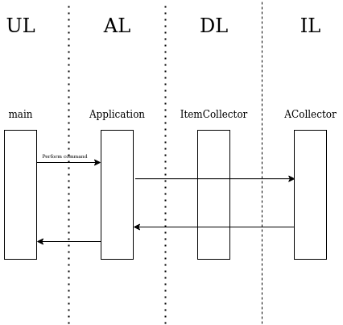

Министерство науки и высшего образования Российской Федерации  
Федеральное государственное бюджетное образовательное учреждение  
высшего образования  
«Московский государственный технический университет  
имени Н.Э. Баумана  
(национальный исследовательский университет)»  
(МГТУ им. Н.Э. Баумана)

ФАКУЛЬТЕТ ИНФОРМАТИКА И СИСТЕМЫ УПРАВЛЕНИЯ  
КАФЕДРА КОМПЬЮТЕРНЫЕ СИСТЕМЫ И СЕТИ (ИУ6)

 

ОТЧЕТ  
к лабораторной работе №3  
по дисциплине "Современные средства разработки  
программного обеспечения"  
Описание модели, изоляция предметной области.

 

Преподаватель: Фетисов М.В.

Студент группы ИУ6-55Б Рожков А.В.

## Описание задания

Задача № 2: "Магазин запчастей".

Постройте диаграмму последовательности выполнения команды clean. Диаграмма должна показывать прохождение выполнения команды между программными объектами, расположенными в соответствующих слоях многоуровневой архитектуры.

## Адрес проекта

Проект хранится в репозитории по адресу: [https://bmstu.codes/lsx/mstd/iu6-5-2020/iu6-55b-avrozhkov/l3](https://bmstu.codes/lsx/mstd/iu6-5-2020/iu6-55b-avrozhkov/l3).

Описание классов хранится в репозитории по адресу: [https://bmstu.codes/lsx/mstd/iu6-5-2020/iu6-55b-avrozhkov/l3](https://bmstu.codes/lsx/mstd/iu6-5-2020/iu6-55b-avrozhkov/l3).

## Диаграмма последовательности

Последовательность выполнения команды clean:

## Выводы

В ходе выполнения данной лабораторной работы были приобретены навыки описания модели предметной области, выполнения ее изоляции, построение диаграммы последовательности выполнения некоторого действия в приложении, а также улучшены навыки работы с внешним репозиторием кода и такими инструментами разработки как git и Doxygen.