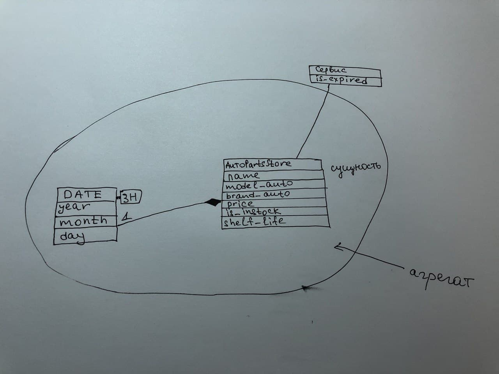

Министерство науки и высшего образования Российской Федерации  
Федеральное государственное бюджетное образовательное учреждение  
высшего образования  
«Московский государственный технический университет  
имени Н.Э. Баумана  
(национальный исследовательский университет)»  
(МГТУ им. Н.Э. Баумана)

ФАКУЛЬТЕТ ИНФОРМАТИКА И СИСТЕМЫ УПРАВЛЕНИЯ  
КАФЕДРА КОМПЬЮТЕРНЫЕ СИСТЕМЫ И СЕТИ (ИУ6)

 

ОТЧЕТ  
к лабораторной работе №4  
по дисциплине "Современные средства разработки  
программного обеспечения"  
Рефакторинг. Выделение сущностей, значений и служб модели.

 

Преподаватель: Фетисов М.В.

Студент группы ИУ6-55Б Рожков А.В.

## Описание задания

Задача № 13: "Магазин запчастей".

Необходимо сформировать ежемесячный отчёт о просроченных товарах для списания. Этот отчёт необходимо сохранять на постоянной основе, т.к. эта информация будет учитываться в будущем.
## Адрес проекта

Проект хранится в репозитории по адресу: [https://bmstu.codes/lsx/mstd/iu6-5-2020/iu6-55b-avrozhkov/l4](https://bmstu.codes/lsx/mstd/iu6-5-2020/iu6-55b-avrozhkov/l4).

Описание классов хранится в репозитории по адресу:[https://bmstu.codes/lsx/mstd/iu6-5-2020/iu6-55b-avrozhkov/l4](https://bmstu.codes/lsx/mstd/iu6-5-2020/iu6-55b-avrozhkov/l4).

## Диаграмма классов агрегата AutoPartsStore

Диаграмма классов агрегата AutoPartsStore:

## Выводы

В ходе лабораторной работы были приобретены навыки оценки необходимых изменений при уточнении модели предметной области, а также работы с внешним репозиторием кода и сценарием непрерывной интеграции.
